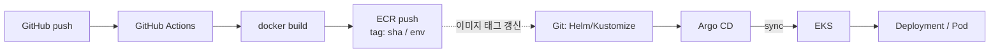

# Aniverse 아키텍처 As-Is / To-Be (금요일 산출물)

| 항목 | 내용 |
|------|------|
| 목적 | EKS 전환 전 As-Is·To-Be 공유 · CI/CD·env·역할 경계 확정 |
| 담당(본 문서 CI/CD·env) | 현우 |
| 네트워크·컴퓨트 | 서이 |
| 컨테이너·DB | 윤주 |
| 계정 | 현우 AWS 계정 · 비용 엔빵 |

관련: [EKS 전환 계획서](./eks-migration-plan.md) · [결정 로그](./decision-log.md) · [트러블슈팅](./troubleshooting-log.md)

---

## 1. As-Is (현재 — EC2 / CodeDeploy)

```text
[개발자]
   │ git push (anime-project / anime-project-infra)
   ▼
[GitHub Actions]
   ├─ infra: terraform plan/apply
   └─ app: zip → S3 → CodeDeploy
         ▼
[ALB] (+ ACM, WAF)
   ▼
[ASG / EC2]  Nginx + Daphne
   ├─ RDS (MariaDB)
   ├─ S3 (media/static)
   ├─ (EFS 등)
   └─ SSM + VPC Endpoint (키리스 접속)
```

**특징:** 앱이 **서버(EC2)에 설치**됨. 배포 단위는 zip + CodeDeploy agent.

**보존:** git 태그 `v1-ec2-codedeploy` (app · infra 각각)

---

## 2. To-Be (목표 — EKS / GitOps)

### 2.1 전체

```text
[개발자]
   │ git push
   ▼
[GitHub Actions] ──build──► [ECR] (이미지 + 태그)
   │
   │ (manifest / values 변경 push)
   ▼
[Argo CD] ──sync──► [EKS Cluster]
                         │
                    [Ingress] → ALB (+ ACM, WAF 재사용 가능)
                         ▼
                    [App Pod]  Django/Daphne (+ Nginx sidecar 선택)
                         ├─ [DB Pod StatefulSet] + PVC(EBS)
                         ├─ Redis (Pod 또는 기존 ElastiCache — 결정 로그)
                         └─ S3 (IRSA 권장)
```

### 2.2 현우 담당: Actions → ECR → Argo CD → 클러스터



| 단계 | 하는 일 | 담당 |
|------|---------|------|
| 1 | 코드 push 시 이미지 빌드 | 현우 (Actions) |
| 2 | ECR에 push · 태그 규칙 | 현우 |
| 3 | Git의 Helm/Kustomize에 태그 반영 | 현우 |
| 4 | Argo CD가 클러스터에 sync | 현우 |
| 5 | 클러스터 · 노드 · Ingress(ALB) | **서이** |
| 6 | Dockerfile · 앱/DB Helm 차트 | **윤주** |

---

## 3. Keep / Replace / Add

| 구분 | 항목 |
|------|------|
| **Keep** | VPC 뼈대(확장), S3, ACM/WAF(연동), Terraform 모듈 구조, As-Is 코드(태그) |
| **Replace** | ASG/EC2 앱 런타임 → Pod / CodeDeploy → Actions+ECR+Argo / RDS → DB Pod(비용·운영 사유) |
| **Add** | EKS, ECR, Argo CD, EBS CSI·PVC, (선택) HPA · Cluster Autoscaler |

---

## 4. env로 뺄 목록 초안 (현우)

ConfigMap / Secret / (추후 IRSA)로 주입. **이미지에 키를 넣지 않음.**

### Secret (민감)

| 변수 | 용도 | 비고 |
|------|------|------|
| `DJANGO_SECRET_KEY` | Django | 필수 |
| `DB_PASSWORD` | DB | Pod DB도 동일 |
| `GEMINI_API_KEY` | 챗봇 | 선택 |
| `AWS_SECRET_ACCESS_KEY` | S3 (키 쓸 때) | **IRSA(`aniverse-web-s3-irsa`)로 대체 — 키 생략** |

### ConfigMap · 일반 env

| 변수 | 용도 | 비고 |
|------|------|------|
| `DJANGO_DEBUG` | 디버그 | 운영 False |
| `DJANGO_ALLOWED_HOSTS` | 호스트 | 도메인·ALB |
| `DJANGO_CSRF_TRUSTED_ORIGINS` | CSRF | https://도메인 |
| `USE_HTTPS` | 쿠키·리다이렉트 | ALB HTTPS 시 True |
| `DB_NAME` / `DB_USER` / `DB_HOST` / `DB_PORT` | DB | HOST=DB Service명 |
| `AWS_STORAGE_BUCKET_NAME` | S3 | |
| `AWS_S3_REGION_NAME` | 리전 | ap-northeast-2 |
| `AWS_ACCESS_KEY_ID` | S3 | IRSA면 생략 (EKS web SA) |
| `GEMINI_MODEL` | 모델명 | |
| `REDIS_URL` 또는 동등 | Channels | To-Be에서 Redis 사용 시 **추가** (현재 코드는 InMemory) |

### 배포·GitOps용 (앱 env 아님)

| 항목 | 용도 |
|------|------|
| 이미지 URI | `계정.dkr.ecr.리전.amazonaws.com/aniverse:태그` |
| 이미지 태그 | `sha-<12>` — Actions ECR push 후 values 자동 bump |
| Argo Application | repo URL, path, destination cluster/namespace |

### 윤주·서이와 맞출 것

- [ ] DB Service DNS명 → `DB_HOST`
- [ ] Ingress 호스트 → `ALLOWED_HOSTS` / CSRF
- [ ] Redis를 Pod로 둘지 · env 키 이름

---

## 5. 서이 ↔ 현우 경계 (맞추기 체크리스트)

회의/노션에서 아래만 합의하면 CI/CD 착수 가능.

| # | 합의 항목 | 서이 | 현우 | 상태 |
|---|-----------|------|------|------|
| 1 | EKS 클러스터 이름 · 리전 · 계정 | 생성 | Argo destination | ⬜ |
| 2 | 앱 Namespace (예: `aniverse`) | 생성 가능 | Application 대상 | ⬜ |
| 3 | Ingress → ALB (도메인, ACM) | Ingress/ALB | ALLOWED_HOSTS·CSRF | ⬜ |
| 4 | 클러스터 접근 (kubeconfig / IRSA for Actions·Argo) | 노드·IAM | Argo·CI 권한 | ⬜ |
| 5 | ECR pull 권한 (노드 역할) | 노드 IAM | ECR 생성·push | ⬜ |
| 6 | GitOps repo 경로 (manifest 위치) | — | 경로 확정 후 공유 | ⬜ |

**한 줄 경계**

- 서이: **클러스터가 존재하고, 파드가 네트워크·스토리지·ALB까지 붙을 수 있게**
- 현우: **이미지가 빌드·푸시되고, Git 선언이 Argo로 그 클러스터에 sync**

---

## 6. 팀 As-Is / To-Be 합치기

| 파트 | 아키텍처에 넣을 박스 | 담당 |
|------|---------------------|------|
| 전체 그림 | As-Is 1장 + To-Be 1장 | 공통 |
| CI/CD 흐름 | §2.2 | 현우 ✅ 본 문서 |
| EKS·노드·CNI·Ingress·EBS | To-Be 인프라 | 서이 |
| App/DB Dockerfile·Helm·StatefulSet | To-Be 워크로드 | 윤주 |

**금요일 게이트:** 세 파트 박스가 한 To-Be 그림에 모이고, [결정 로그](./decision-log.md)에 계정·DB Pod·테스트 환경이 적혀 있을 것.

---

## 7. 현우 다음 액션 (본 산출물 이후)

1. 서이와 §5 표 체크  
2. 이미지 태그 규칙 팀 공유  
3. Phase B: Actions 빌드 워크플로 뼈대 (`anime-project`)  
