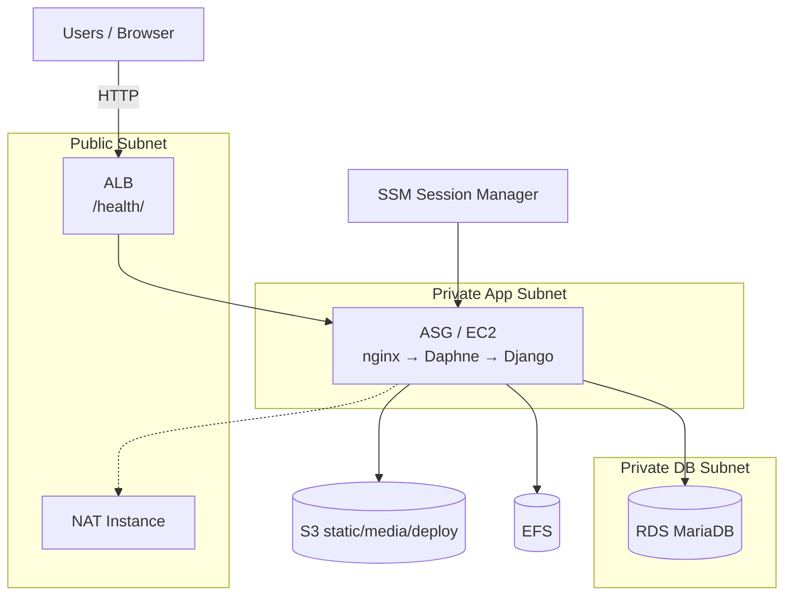
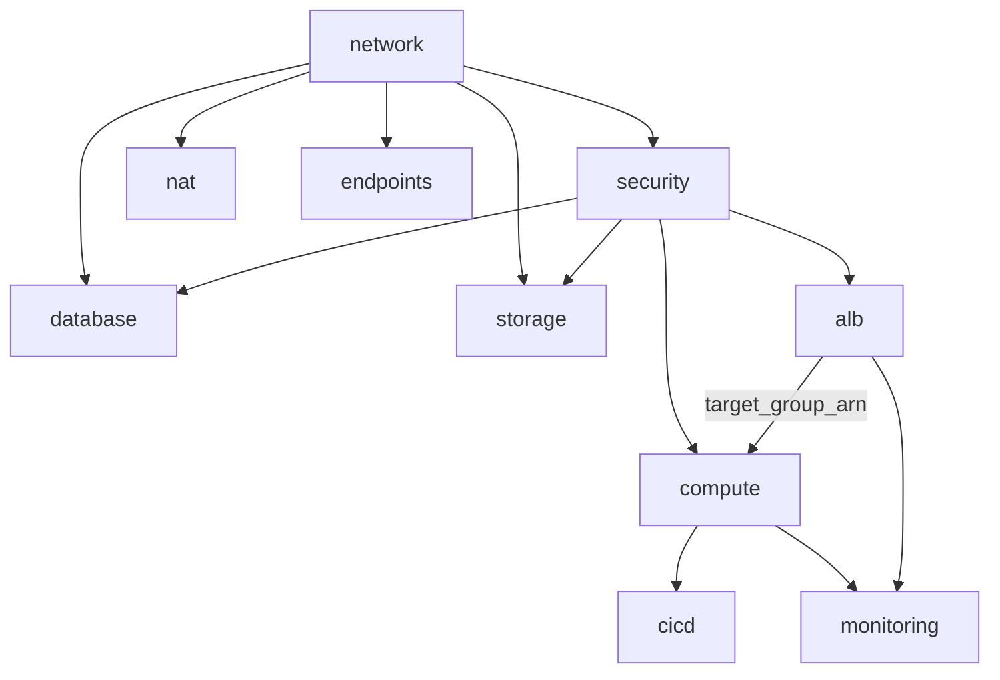
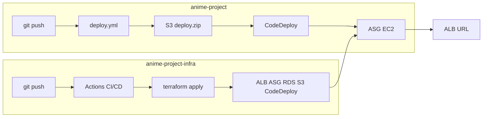

# Aniverse 발표 자료 (그림 · 표 · 구성도)

이미지 파일 위치: `docs/presentation/images/`

| 파일 | 용도 |
|------|------|
| `aniverse-architecture-overview.png` | 전체 아키텍처 슬라이드 |
| `aniverse-cicd-pipeline.png` | CI/CD 파이프라인 슬라이드 |
| `aniverse-terraform-modules.png` | Terraform 모듈 구성도 |
| `aniverse-problems-solved.png` | Before/After 트러블슈팅 |
| `architecture-clean.svg` | 벡터용 아키텍처 (PPT에서 확대 가능) |

---

## 1. 전체 아키텍처 (Mermaid)

---

## 2. Terraform 모듈 의존성

**핵심 메시지:** `alb`를 `compute`에서 분리하고 Terraform `moved`로 **기존 ALB 재생성 없이** state만 이전 (0 destroy).

---

## 3. CI/CD 흐름

---

## 4. 발표용 표

### 4-1. 저장소 역할

| 저장소 | 역할 | 주요 산출물 |
|--------|------|-------------|
| `anime-project-infra` | IaC / 인프라 자동화 | VPC, ALB, ASG, RDS, S3, CodeDeploy |
| `anime-project` | 애플리케이션 배포 | Django + Daphne + nginx |

### 4-2. 모듈 한눈에

| 모듈 | 설명 |
|------|------|
| network / security / nat / endpoints | 네트워크·보안·관리 접속 |
| database | RDS + 스냅샷 복원 로직 |
| storage | EFS + static S3 |
| **alb** | ALB + TG + Listener |
| **compute** | LT / ASG / IAM |
| cicd / monitoring | CodeDeploy, CloudWatch |

### 4-3. 런타임 스택

| 계층 | 기술 |
|------|------|
| Edge | ALB HTTP:80, health `/health/` |
| Web | nginx |
| App | Daphne (ASGI) + Django |
| Data | RDS MariaDB, S3, EFS |
| Ops | SSM, CodeDeploy, GitHub Actions |

### 4-4. 문제 → 해결

| 문제 | 해결 |
|------|------|
| Actions CD 미동작 | `terraform-cd.yml` + TF 1.10.5 |
| compute에 ALB 혼재 | `modules/alb` + `moved` (0 recreate) |
| 챗봇/WebSocket 실패 | CSRF + Gemini 주입 + Daphne |
| 이미지 403 | S3 public GetObject + media sync |
| RDS var IDE 오탐 | database locals literal + CD 패치 |

### 4-5. Secrets (데모용 요약)

| 구분 | 필수 예시 |
|------|-----------|
| Infra | `AWS_*`, `TF_VAR_DB_PASSWORD`, `TF_VAR_DJANGO_SECRET_KEY` |
| App | `AWS_*`, `S3_BUCKET_NAME`, (선택) `GEMINI_API_KEY` |

---

## 5. 슬라이드 배치 추천

1. 표지  
2. **architecture-overview.png** + 아키텍처 설명  
3. **terraform-modules.png** + 모듈 표(4-2)  
4. **cicd-pipeline.png** + Secrets 표(4-5)  
5. 런타임 표(4-3) + 데모(ALB URL)  
6. **problems-solved.png**  
7. 결론 / 향후(도메인·HTTPS)

---

## 6. PPT에 넣는 방법

1. `docs/presentation/images/*.png` 를 슬라이드에 삽입  
2. 위 표를 복사해 PPT 표로 변환  
3. Mermaid는 [mermaid.live](https://mermaid.live)에서 Export PNG/SVG
